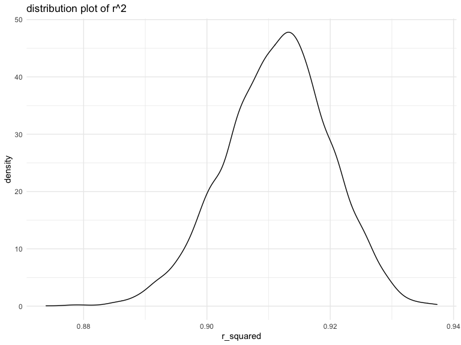

Homework 6
================
Yue Liu
2020-12-08

## Problem 1

Read in the data

``` r
homicide_df = 
  read_csv("data/homicide-data.csv", na = c("", "NA", "Unknown")) %>% 
  mutate(
    city_state = str_c(city, state, sep = ", "),
    victim_age = as.numeric(victim_age),
    resolution = case_when(
      disposition == "Closed without arrest" ~ 0,
      disposition == "Open/No arrest"        ~ 0,
      disposition == "Closed by arrest"      ~ 1
    )
  ) %>% 
  filter(
    victim_race %in% c("White", "Black"),
    city_state != "Tulsa, AL")%>% 
  select(city_state, resolution, victim_age, victim_race, victim_sex)
```

    ## Parsed with column specification:
    ## cols(
    ##   uid = col_character(),
    ##   reported_date = col_double(),
    ##   victim_last = col_character(),
    ##   victim_first = col_character(),
    ##   victim_race = col_character(),
    ##   victim_age = col_double(),
    ##   victim_sex = col_character(),
    ##   city = col_character(),
    ##   state = col_character(),
    ##   lat = col_double(),
    ##   lon = col_double(),
    ##   disposition = col_character()
    ## )

start with one city

``` r
baltimore_df =
  homicide_df %>% 
  filter(city_state == "Baltimore, MD")

# generalized regression model
glm(resolution ~ victim_age + victim_race + victim_sex,
    data = baltimore_df,
    family = binomial()) %>%  # need to specify distribution
  broom::tidy() %>% # estimate is reported as log odds ratio; race shows in 5 subgroups
  mutate(
    OR = exp(estimate),
    CI_lower = exp(estimate - 1.96 * std.error),
    CI_upper = exp(estimate + 1.96 * std.error)
  ) %>% 
  select(term, OR, starts_with("CI")) %>% 
  knitr::kable(digits = 3)
```

| term              |    OR | CI\_lower | CI\_upper |
| :---------------- | ----: | --------: | --------: |
| (Intercept)       | 1.363 |     0.975 |     1.907 |
| victim\_age       | 0.993 |     0.987 |     1.000 |
| victim\_raceWhite | 2.320 |     1.648 |     3.268 |
| victim\_sexMale   | 0.426 |     0.325 |     0.558 |

Try this across cities.

``` r
models_results_df = 
  homicide_df %>% 
  nest(data = -city_state) %>% 
  mutate(
    models = 
      map(.x = data, ~glm(resolution ~ victim_age + victim_race + victim_sex, data = .x, family = binomial())),
    results = map(models, broom::tidy)
  ) %>% 
  select(city_state, results) %>% 
  unnest(results) %>% 
  mutate(
    OR = exp(estimate),
    CI_lower = exp(estimate - 1.96 * std.error),
    CI_upper = exp(estimate + 1.96 * std.error)
  ) %>% 
  select(city_state, term, OR, starts_with("CI")) 
```

``` r
models_results_df %>% 
  filter(term == "victim_sexMale") %>% 
  mutate(city_state = fct_reorder(city_state, OR)) %>% 
  ggplot(aes(x = city_state, y = OR)) + 
  geom_point() + 
  geom_errorbar(aes(ymin = CI_lower, ymax = CI_upper)) + 
  theme(axis.text.x = element_text(angle = 90, hjust = 1))
```


## Problem 2

``` r
birthweight_df = 
  read_csv("data/birthweight.csv", na = c("", "NA", "Unknown")) %>% 
  mutate(babysex = as.factor(case_when(babysex == 1 ~ "male", 
                                       babysex == 2 ~ "female")),
         frace = as.factor(case_when(frace == 1 ~ "White",
                                     frace == 2 ~ "Black",
                                     frace == 3 ~ "Asian",
                                     frace == 4 ~ "Puero Rican",
                                     frace == 8 ~ "Other",
                                     frace == 9 ~ "Unknown")),
         malform = as.factor(case_when(malform == 0 ~ "absent",
                                       malform == 1 ~ "present")),
         mrace = as.factor(case_when(mrace == 1 ~ "White",
                                     mrace == 2 ~ "Black",
                                     mrace == 3 ~ "Asian",
                                     mrace == 4 ~ "Puero Rican",
                                     mrace == 8 ~ "Other",
                                     mrace == 9 ~ "Unknown"))
         )
```

    ## Parsed with column specification:
    ## cols(
    ##   .default = col_double()
    ## )

    ## See spec(...) for full column specifications.

Import dataset and convert `babysex`, `frace`(father’s race),
`mrace`(mother’s race), and `malform`(presence of malformations) to
factor.

Since there is no further information on which predictors might be more
significant, I used backward stepwise regression to select variables.

``` r
my_model = lm(bwt ~ ., data = birthweight_df) %>% 
  step(direction = 'backward', trace = 0)

summary(my_model)
```

    ## 
    ## Call:
    ## lm(formula = bwt ~ babysex + bhead + blength + delwt + fincome + 
    ##     gaweeks + mheight + mrace + parity + ppwt + smoken, data = birthweight_df)
    ## 
    ## Residuals:
    ##      Min       1Q   Median       3Q      Max 
    ## -1097.18  -185.52    -3.39   174.14  2353.44 
    ## 
    ## Coefficients:
    ##                    Estimate Std. Error t value Pr(>|t|)    
    ## (Intercept)      -6145.1507   141.9496 -43.291  < 2e-16 ***
    ## babysexmale        -28.5580     8.4549  -3.378 0.000737 ***
    ## bhead              130.7770     3.4466  37.944  < 2e-16 ***
    ## blength             74.9471     2.0190  37.120  < 2e-16 ***
    ## delwt                4.1067     0.3921  10.475  < 2e-16 ***
    ## fincome              0.3180     0.1747   1.820 0.068844 .  
    ## gaweeks             11.5925     1.4621   7.929 2.79e-15 ***
    ## mheight              6.5940     1.7849   3.694 0.000223 ***
    ## mraceBlack         -63.9057    42.3663  -1.508 0.131523    
    ## mracePuero Rican   -25.7914    45.3502  -0.569 0.569578    
    ## mraceWhite          74.8868    42.3146   1.770 0.076837 .  
    ## parity              96.3047    40.3362   2.388 0.017004 *  
    ## ppwt                -2.6756     0.4274  -6.261 4.20e-10 ***
    ## smoken              -4.8434     0.5856  -8.271  < 2e-16 ***
    ## ---
    ## Signif. codes:  0 '***' 0.001 '**' 0.01 '*' 0.05 '.' 0.1 ' ' 1
    ## 
    ## Residual standard error: 272.3 on 4328 degrees of freedom
    ## Multiple R-squared:  0.7181, Adjusted R-squared:  0.7173 
    ## F-statistic: 848.1 on 13 and 4328 DF,  p-value: < 2.2e-16

According to the results, my model will contain predictors `babysex`,
`bhead`(baby’s head circumference), `blength` (baby’s length at birth),
`delwt`(mother’s weight), `fincome`(family monthly income),
`gaweeks`(gestational age in weeks), `mheight`(mother’s height),
`mrace`(mother’s race), `parity`(number of live births prior to this
pregnancy), `ppwt` (mother’s pre-preg weight), and `smoken` (average
numbers of cigarettes smoked during pregnancy)

Plot of model residuals against fitted values.

``` r
ggplot() +
  geom_point( 
    data = birthweight_df %>% 
      add_residuals(my_model) %>% 
      add_predictions(my_model),
    alpha = 0.5) +
  aes(x = pred, y = resid) +
  labs(title = "Residual Plot",  
       x = "Predicted/Fitted value", 
       y = "Residual") 
```


cross validation using `modelr`

``` r
cv_df = 
  crossv_mc(birthweight_df, 100) %>% 
  mutate(
    train = map(train, as_tibble),
    test = map(test, as_tibble))

cv_df = 
  cv_df %>% 
  mutate(
    my_mod = map(.x = train, ~ lm(bwt ~ babysex + bhead + blength + delwt + fincome + gaweeks + mheight + mrace + parity + ppwt +smoken, data = .x)),
    mod_1 = map(.x = train, ~ lm(bwt ~ blength + gaweeks, data = .x)),
    mod_2 = map(.x = train, ~ lm(bwt ~ blength * bhead * babysex, data = .x))
    ) %>%
  mutate(
    rmse_my = map2_dbl(.x = my_mod, .y = test, ~rmse(model = .x, data = .y)),
    rmse_1 = map2_dbl(.x = mod_1, .y = test, ~rmse(model = .x, data = .y)),
    rmse_2 = map2_dbl(.x = mod_2, .y = test, ~rmse(model = .x, data = .y))
)
```

``` r
cv_df %>% 
  select(starts_with("rmse")) %>% 
  pivot_longer(
    everything(),
    names_to = "model",
    values_to = "rmse",
    names_prefix = "rmse_"
  ) %>% 
  ggplot(aes(x = model, y = rmse)) +
  geom_violin()
```


From the plot we can see that `my model` has the lowest rmse among all
three polts.

``` r
cv_df %>% 
  select(starts_with("rmse")) %>% 
  pivot_longer(
    everything(),
    names_to = "model",
    values_to = "rmse",
    names_prefix = "rmse_"
  ) %>% 
  group_by(model) %>% 
  summarize(avg_rmse = mean(rmse)) %>% 
  knitr::kable()
```

    ## `summarise()` ungrouping output (override with `.groups` argument)

| model | avg\_rmse |
| :---- | --------: |
| 1     |  334.1208 |
| 2     |  288.8328 |
| my    |  272.8895 |

## Problem 3

Load in data

``` r
weather_df = 
  rnoaa::meteo_pull_monitors(
    c("USW00094728"),
    var = c("PRCP", "TMIN", "TMAX"), 
    date_min = "2017-01-01",
    date_max = "2017-12-31") %>%
  mutate(
    name = recode(id, USW00094728 = "CentralPark_NY"),
    tmin = tmin / 10,
    tmax = tmax / 10) %>%
  select(name, id, everything())
```

    ## Registered S3 method overwritten by 'hoardr':
    ##   method           from
    ##   print.cache_info httr

    ## using cached file: /Users/deidei/Library/Caches/R/noaa_ghcnd/USW00094728.dly

    ## date created (size, mb): 2020-10-04 19:30:14 (7.522)

    ## file min/max dates: 1869-01-01 / 2020-10-31

Bootstap 5000 samples:

``` r
set.seed(1)

boot_results = 
  weather_df %>% 
  bootstrap(5000, id = "strap_number") %>% 
  mutate(
    models = map(.x = strap, ~ lm(tmax ~ tmin, data = .x)),
    results = map(models, broom::tidy)
  ) %>% 
  unnest(results) %>% 
  mutate(r_square = map(models, broom::glance)) %>% 
  select(strap_number, term, estimate, r_square) %>% 
  unnest(r_square) %>% 
  select(strap_number, term, estimate, r.squared)
```

``` r
boot_results = 
  boot_results %>% 
  pivot_wider(
    names_from = term,
    values_from = estimate
  ) %>% 
  janitor::clean_names() %>% 
  mutate(log = log(tmin*intercept))
```

Distribution plot of r^2.

``` r
boot_results %>% 
  ggplot(aes(x = r_squared)) +
  geom_density() +
  labs(title = "distribution plot of r^2")
```



From the plot we can see a bell-shaped distribution with a median value
at about 0.91, indicating then normal distribution of r^2.

Distribution plot of log(beta0\*beta1)

``` r
boot_results %>% 
  ggplot(aes(x = log)) +
  geom_density()+
  labs(title = "distribution plot of coefficients")
```


From the plot we can see a bell-shaped distribution with a median value
at about 2.00, indicating then normal distribution of log(beta0\*beta1).

95% Confidence Interval for r^2 and log(beta0\*beta1):

``` r
boot_results %>% 
  summarize(
    r2_ci_lower = quantile(r_squared, 0.025),
    r2_ci_upper = quantile(r_squared, 0.975),
    beta_ci_lower = quantile(log, 0.025),
    beta_ci_upper = quantile(log, 0.975)
  )
```

    ## # A tibble: 1 x 4
    ##   r2_ci_lower r2_ci_upper beta_ci_lower beta_ci_upper
    ##         <dbl>       <dbl>         <dbl>         <dbl>
    ## 1       0.894       0.927          1.96          2.06

The 95% confidence interval for r^2 is (0.894, 0.927).

The 95% confidence interval for log(beta0\*beta1) is (1.96, 2.06).
